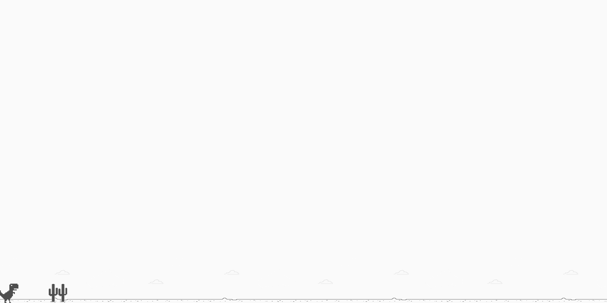

<h1 align="center">
Jogo do Google
</h1>

Este projeto foi desenvolvido acompanhando  a aula da DIGITAL INOVATION ONE que se trata de uma copia do famoso jogo do google

  
   
   

  

## Aprendizado
O projeto foi feito para aperfeiçoar alguns conceitos, o projeto conta com um arquivo Css e HTML simples mais um arquivo Javascript onde criamos cada função do nosso jogo como  por exemplo o salto, a geração aleatoria dos cactos e o "fim de jogo".

## Tecnologias Utilizadas

- [X] HTML
- [X] CSS
- [X] Javascript

## :arrow_forward: Como executar

Para executar o jogo é so baixar os arquivos e abrir o arquivo index.html em qualquer navegador e pronto! Depois só se divertir.
